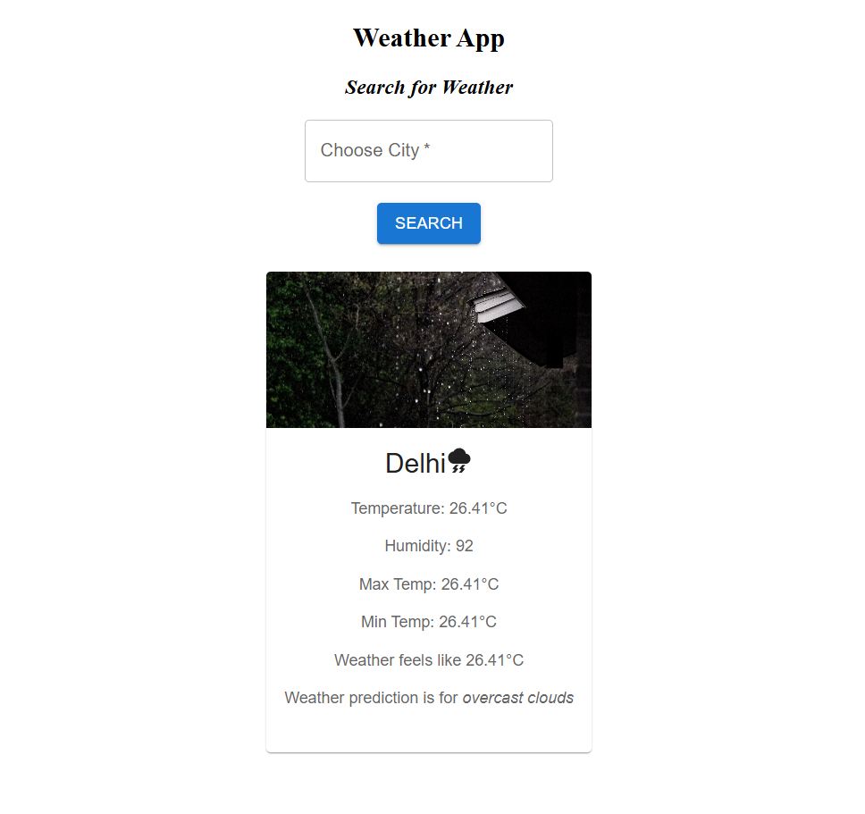

# Weather App

A responsive web application, built for Users to search any city, and fetch real-time weather information seamlessly.

---

## Features

- Search weather by the name of city
- Current temperature
- Feels like temperature
- Humidity
- Maximum temperature
- Minimum temperature
- Weather description

---

## Tech Stack

- React
- Vite
- JavaScript
- HTML
- CSS
- Material UI
- OpenWeather API

---

## Home Page



---

## Folder Structure

```
src
├── assets
├── App.jsx
├── WeatherApp.jsx
├── SearchBox.jsx
├── InfoBox.jsx
├── main.jsx
```

---

## Installation

Clone the repository

```bash
git clone https://github.com/scrpoglow/weather-app-react.git
```

Move into the folder

```bash
cd weather-app-react
```

Install dependencies

```bash
npm install
```

Run the application

```bash
npm run dev
```

---

## Environment Variables

Create a `.env` file in the project root.

```env
VITE_API_URL=https://api.openweathermap.org/data/2.5/weather
VITE_API_KEY=YOUR_API_KEY
```

---

## Author

**Madhura**

GitHub: https://github.com/scrpoglow
